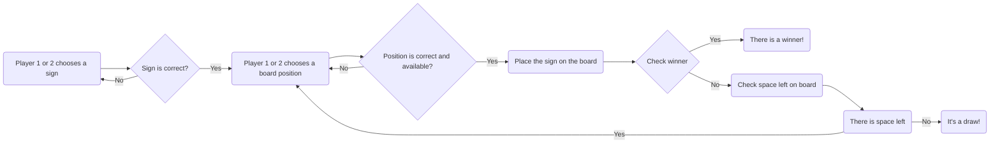

Here is the core structural logic of how the game should work:

    1. Player_1 chooses a sign:
    1.1 This step is repeated until the player chooses a right sign [X,0]
    2. Player_1 chooses a position on the board:
    2.1 This step is repeated until the player chooses a right position [1,2,3,4,5,6,7,8,9]
    2.2 We check if the position is empty or already occupied by an X or a 0. If so, we go back to step 2.1
    3. After we have successfully placed the sign, we check for a winner
    4. If no winner, steps 2 and 3 are repeated for Player_2
    5. If no winner, steps 2 and 3 are repeated for Player_1
    6. If no winner, steps 2 and 3 are repeated for Player_2.....
    .....
    ....
    
### FlowChart
Here is a simple flow chart:

